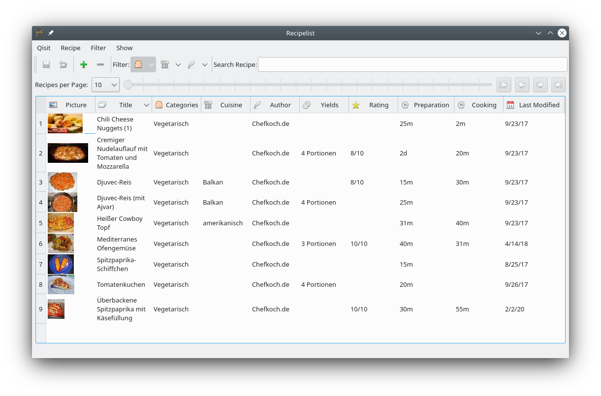
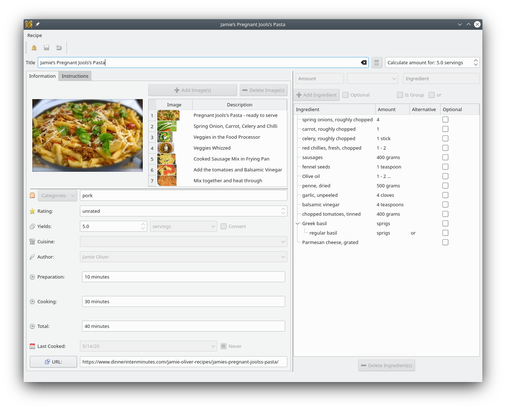
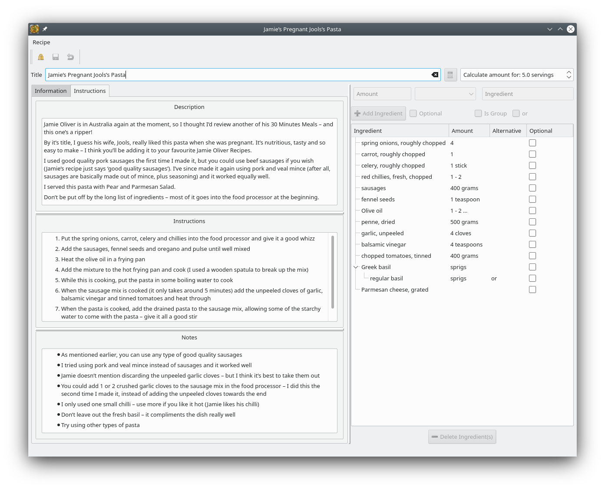

# Changes to Gourmet
These are the changes compared to Gourmet:
## Backend/Database
* The database has been completely redesigned from scratch, including constraints/foreign keys, indexes, data
deduplication
* Qisit fully supports SQLite, MySQL/MariaDB and PostgreSQL as backends. Possible more, these three RDBMS has been 
successfully tested. 

## UI
Qisit aims to separate the backend/database and the UI, so it would be possible to run a text based version in the 
console - or use a web framework to display your recipes. If you don't like Qt, you could easily create a GTK version

### Qt instead of GTK2
There are a couple of reasons for selecting Qt:
* I had some Qt experience before. Since time was a factor (Gourmet getting removed from more and more distributions) 
instead of learning Gtk3 (Gtk2, which Gourmet used, was long EOL) I choose Qt as the 
desktop UI
* Qt seems to be more platform agnostic compared to Gtk2, so it's easier to port it to Windows, for example
* There's even the possibility of running a PyQt5 program on Android, so a mobile version of Qisit is quite possible!

### Reduced set of windows
* Instead of having two different windows for displaying a recipe and editing it, there's only one recipe window. 
You can set it read-only or make it editable, in which some widgets change. For example, the text edits 
(Description, Instructions, Notes) change from displaying visual Markdown to editing the source,
the time edits also change.
* There's no "browse recipe" window/tab. Instead you can use the much more flexible filter approach - filter by 
category, cuisine, author in the recipe list window to accomplish just that - plus you can even 
*combine* the filters. Here I've chosen only to display the vegetarian recipes

## Additional features
* You can have multiple categories. Although Gourmet supports this it's very, very well hidden in the UI - in fact 
even Gourmet developers are unaware of this, so it's technically no change..
* You can have as much images per recipe as you like. This is useful when the pictures display different stages of the
dish.
* There's a description for each recipe. This is was planned in Gourmet, too, but not implemented although it's a db 
db fields
* In addition to preparation and cooking time, there's a third time field - total time. Total time doesn't have to be
the sum of preparation and cooking time: Consider a dish that needs to marinate a few days in the fridge.
* There's also a field "Last cooked" so you can note - if you want - when you've last cooked that dish. Might be useful
when sorting the recipe list. This also makes a "ToDo" category unnecessary.
* Ingredients can have alternatives, these alternatives can be further grouped. For example you have a recipe with
3 teaspoons of "italian herbs". Alternatively you could specify "1.5 teaspoon oregano and 1.5 teaspoon basil"

Here are two screenshot displaying a recipe with an alternative ingredient:
 

## Missing/removed features
* Recipes can't ingredients (in Gourmet they can be). There's a much better feature in planning - menus. 
This is one of the few cases where Gourmet's data is discarded
* Nutritional data won't be imported, either. The reason behind this: Those data are old and in an deprecated format 
not supported any more by the FDA. So there's no point in importing them - as soon as the nutrional feature is 
implemented those old data would be completely useless and you've have to edit the mappings ingredient <-> FDA data
again anyway. 
* Shopping list.. I'm not sure if it's really a feature people use. Consider this: People have already shopping list
programms (possibly connected to their smart speakers) so I'm not sure if a separate, disconnected shopping list would 
really make sense. Maybe using - if available, that is - API calls to (for example) Google Keep would make more sense 
but I'm open to suggestions
* Undo/Redo has been replaced by a generic "revert/save"-Feature. A complete undo/redo implementation would be 
**much** more work. The additional usefulness compared to revert/save would be only marginal. On the other hand, the
revert/save feature works also on a global level: Before saving you can always revert the whole database
to it's last saved state.
* For similar reasons there's no "trashcan" feature like in Gourmet. Would also be *very* complicated, also this feature
was not exactly reliably working in Gourmet...

For a more comprehensive list, take a look at [ToDo](Todo.md)
