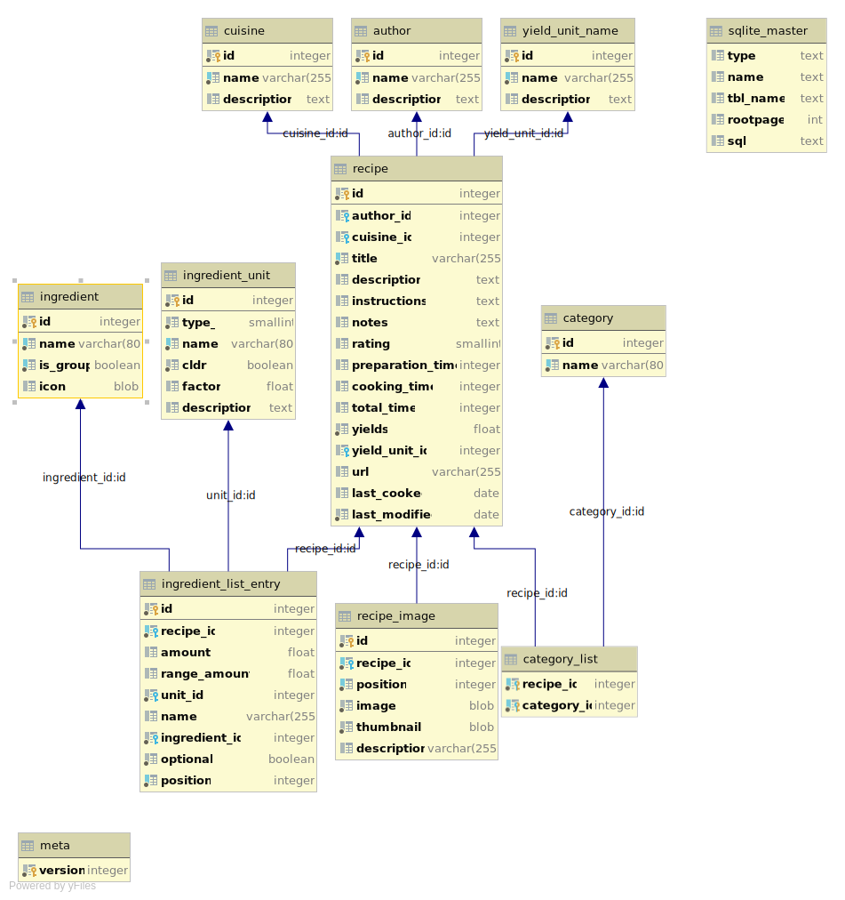

# Database
Table | Purpose
-----|-------
| [author](../../src/core/db/data/author.py) | Authors for recipes |
| [category](../../src/core/db/data/category.py) | Categories for recipes | 
| [category_list](../../src/core/db/data/category_list.py) | Categories that a recipe has |
| [cuisine](../../src/core/db/data/cuisine.py) | Cuisines for recipes | 
| [ingredient](../../src/core/db/data/ingredient.py) | A "generic" ingredient  |
| [ingredient_list_entry](../../src/core/db/data/ingredient_list_entry.py) | The ingredients for a recipe |
| [ingredient_unit](../../src/core/db/data/ingredient_unit) | A (amount) unit for an ingredient on the recipe's list of ingredients |
| [meta](../../src/core/db/data/meta.py) | Meta information, like version |
| [recipe](../../src/core/db/data/recipe.py) | Recipes |
| [recipe_images](../../src/core/db/data/recipe_image.py) | Images/pictures for a recipe |
| [yield_unit_ name](../../src/core/db/data/yield_unit_name.py) | A unit for yields (e.g. loaf, serving, ...)

## Overview
This the database's diagram (taken from sqlite):
